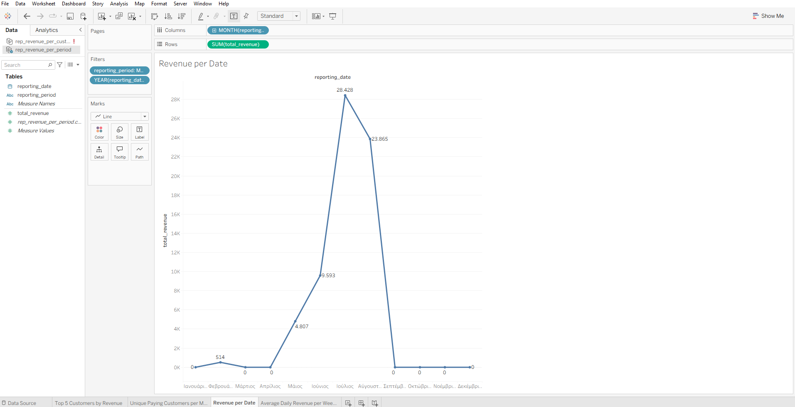
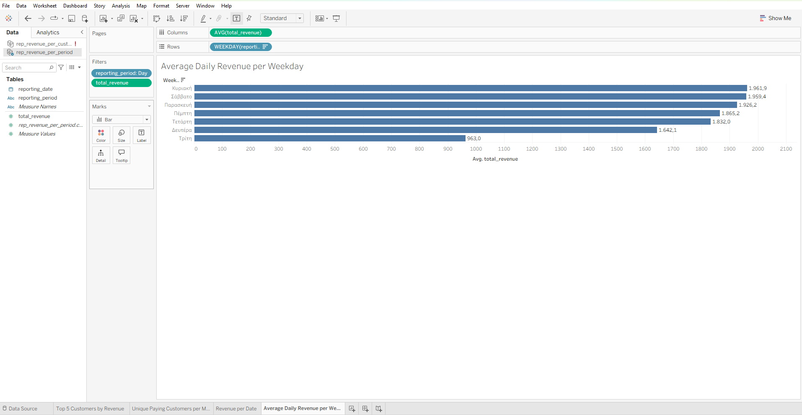
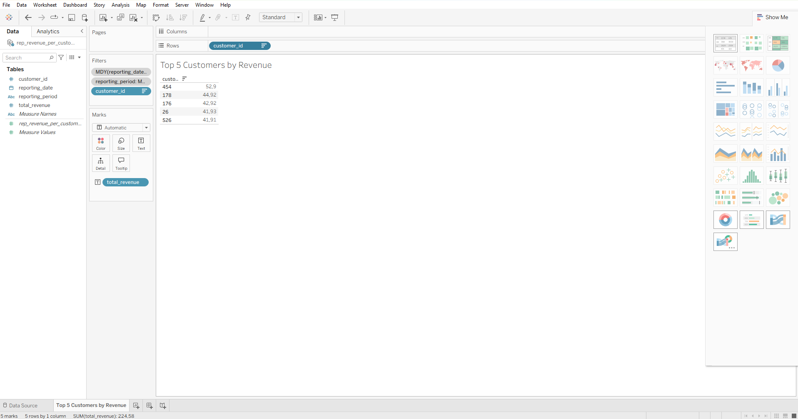
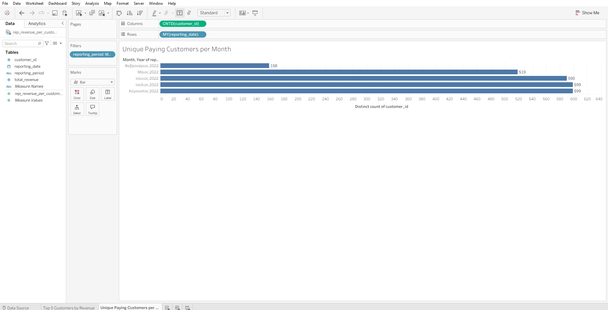

# Capstone Project: Data Analytics in Modern Corporate Business 2026

End-to-end capstone project for the Data Analytics in Modern Corporate Business 2026 course.

This repository contains the staging and reporting scripts, the exported reporting datasets, the written answers to the assignment questions, and the visualization outputs produced in Tableau and Metabase.

## Repository Contents

- `scripts/staging/`: Python scripts for the 15 staging tables
- `scripts/reporting/`: Python scripts for the 2 reporting tables
- `exports/`: CSV exports used as Tableau Desktop data sources
- `answers.txt`: final answers to the 4 assignment questions
- `screenshots/`: Metabase visualization screenshots
- `*.twb`: Tableau workbook files created for the assignment

## Assignment Questions and Results

### Q1. Using `rep_revenue_per_period` - What's the % diff between May '22 and June '22?

**Answer:** June 2022 revenue ($9,592.94) was **99.54%** higher than May 2022 revenue ($4,807.46).

**Tableau**



Tableau Public: https://public.tableau.com/app/profile/stella.argyraki/viz/RevenueperDate/RevenueperDate?publish=yes

**Metabase**


### Q2. Using `rep_revenue_per_period` - What's the weekday with the highest average revenue?

**Answer:** **Sunday**, with an average daily revenue of **$1,961.94**.

**Tableau**



Tableau Public: https://public.tableau.com/app/profile/stella.argyraki/viz/AverageDailyRevenueperWeekday/AverageDailyRevenueperWeekday?publish=yes

**Metabase**


### Q3. Using `rep_revenue_per_customer_and_period` - Which are the top 5 customers by revenue for June 2022?

**Answer:**

1. customer_id 454 - $52.90
2. customer_id 178 - $44.92
3. customer_id 176 - $42.92
4. customer_id 26 - $41.93
5. customer_id 526 - $41.91

**Tableau**



Tableau Public: https://public.tableau.com/app/profile/stella.argyraki/viz/Top5CustomersByRevenue/Top5CustomersbyRevenue?publish=yes

**Metabase**


### Q4. Using `rep_revenue_per_customer_and_period` - Which is the month with the most unique customers?

**Answer:** **July 2022 and August 2022** are tied with **599** unique paying customers each.

**Tableau**



Tableau Public: https://public.tableau.com/app/profile/stella.argyraki/viz/UniquePayingCustomersperMonth/UniquePayingCustomersperMonth?publish=yes

**Metabase**


## Supporting Files

- Answers file: [answers.txt](answers.txt)
- Tableau screenshot notes and public links: [tableau-answers.md](tableau-answers.md)
- Metabase query pack: [metabase_queries.sql](metabase_queries.sql)

## Metabase Setup

Metabase was run locally with Docker, as required by the assignment.

### Option 1: Direct Docker Command

```bash
docker run -d -p 3000:3000 --name metabase metabase/metabase
```

After the container starts, open `http://localhost:3000/` and complete the initial Metabase setup.

### Option 2: Docker Compose

This repository includes a minimal Compose file:

- `docker-compose.yml`

Start Metabase with:

```bash
docker compose up -d
```

Stop it with:

```bash
docker compose down
```

Metabase will be available at `http://localhost:3000/`.

## Notes

- Tableau Public Desktop used CSV exports from `exports/` because the free desktop version does not connect directly to BigQuery.
- The assignment requires both the visualization and the written answer for each question.

